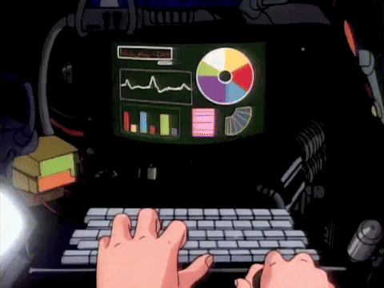

  

# Hey. I'm Jhonatan.

Fair warning: I have a massive obsession with **systems programming** and what happens when code gets close to the metal. There's something about understanding how things work underneath — memory, registers, kernel — that genuinely fascinates me.

Right now, I'm building a low-latency kernel, because I wanted to run games with predictable latency and couldn't find anything that solved it the way I wanted. It's a hobby, not a way to pay the bills, but it's where I spend most of my free time.

Anyway, here's what I'm building:

- **KinetOS** — a low-latency kernel focused on predictability (p99/p999).

And whatever else I have pinned on my GitHub profile right below. Take a look around.

---

# Hey. I'm Jhonatan.

Fair warning: I have a massive obsession with **systems programming** and what happens when code gets close to the metal. There's something about understanding how things work underneath — memory, registers, kernel — that genuinely fascinates me.

Right now, I'm building a low-latency kernel, because I wanted to run games with predictable latency and couldn't find anything that solved it the way I wanted. It's a hobby, not a way to pay the bills, but it's where I spend most of my free time.

Anyway, here's what I'm building:

- **KinetOS** — a low-latency kernel focused on predictability (p99/p999).

And whatever else I have pinned on my GitHub profile right below. Take a look around.

---

### Stack

